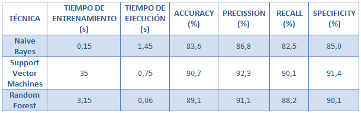

## Introducción

Mushrooms4all es una empresa encargada de fomentar la venta y recolección de setas. Uno de los problemas del sector es la existencia de setas no aptas para el consumo. Por suerte, disponen de una gran base de datos con información sobre distintas características de las setas y  su aptitud (o no) para el consumo humano. 

Sin embargo, les gustaría ser capaces de predecir a partir de la base de conocimiento si una seta desconocida es o no venenosa simplemente identificando sus características. Para ello solicitan la creación de una aplicación que mediante la creación de un modelo  de los datos disponibles lleve a cabo dicha predicción.

## Entendimiento y preparación de los datos 

### Descripción de los datos

En primer lugar, tras recibir de manos de Mushrooms4All el dataset, lo importamos así como el conjunto de librerías que vamos a utilizar.

```{r}
suppressMessages(library(caret))
suppressMessages(library(ggplot2))
suppressMessages(library(dplyr))
suppressMessages(library(gridExtra))
suppressMessages(library(gmodels))
suppressMessages(library(ggparallel))
suppressMessages(library(rpart.plot))
suppressMessages(library(sqldf))
suppressMessages(library(tidyverse))
suppressMessages(library(vcd))
suppressMessages(library(GoodmanKruskal))
suppressMessages(library(dismo))
suppressMessages(library(MLmetrics))
suppressMessages(library(ROCR))
suppressMessages(library(e1071))
suppressMessages(library(randomForest))
setas<-read.csv("../inputs/mushrooms.csv", header = TRUE)
```

A continuación se analiza la apariencia de nuestros datos: 

- Consisten en 8124 observaciones de 23 variables
- Todas las variables son categoricas con letras como valores
- Las variables son las siguientes:

  - cap-shape: forma del gorro.
  - cap-surface: superficie del gorro.
  - cap-color: color del gorro.
  - bruises: si tiene manchas.
  - odor: olor.
  - gill-attachment: unión de las agallas.
  - gill-spacing: espacio entre las agallas.
  - gill-size: tamaño de las agallas.
  - gill-color: color de las agallas.
  - stalk-shape: forma del tallo.
  - stalk-root: raíz del tallo.
  - stalk-surface-above-ring: tipo de superficie sobre el anillo.
  - stalk-surface-below-ring: tipo de superficie por debajo del anillo.
  - stalk-color-above-ring: color sobre el anillo.
  - stalk-color-below-ring: color bajo el anillo.
  - veil-type: tipo de velo.
  - veil-color: color del velo.
  - ring-number: número de anillos.
  - ring-type: tipo de anillo.
  - spore-print-color:color de las espras.
  - population: tamaño de la población.
  - habitat: lugar en el que crecen.

```{r}
head(setas)
```

```{r}
dim(setas)
```

```{r}
glimpse(setas)
```
Numero de niveles de cada variable:
```{r}
number_class <- function(x){
  x <- length(levels(x))
}
x <- setas %>% map_dbl(function(.x) number_class(.x)) %>% as_tibble() %>% 
  rownames_to_column() %>% arrange(desc(value))
colnames(x) <- c("Variable name", "Number of levels")
print(x)
```

###Verificación de la calidad de los datos

Se observa que los valores de las variables se definen utilizando una sola letra, lo que los convierte en ilegibles para el observador humano. Por ello se llevará a cabo un procedimiento de formateo de los datos (ver apartado siguiente).

Se comprobó la existencia de missing values, no encontrando ninguno.

```{r}
map_dbl(setas, function(.x) {sum(is.na(.x))})

```

### Formateo de los datos*


*Aunque según el CRISP-DM esta tarea correspondería a la  fase  de preparación de los datos y aunque aún no se ha finalizado el reporte de la fase de entendimiento, hemos decidido incluirla en este apartado para lograr gráficos con nombres de valor de variables significativos. 

Comenzamos renombrando los nombres de las variables para adaptarlos al formato Snake Case y dotar algunos de ellos de más significado como el caso de la antigua "class" nueva "edibility".
```{r}
colnames(setas) <- c("edibility", "cap_shape", "cap_surface", 
                        "cap_color", "bruises", "odor", 
                        "gill_attachement", "gill_spacing", "gill_size", 
                        "gill_color", "stalk_shape", "stalk_root", 
                        "stalk_surface_above_ring", "stalk_surface_below_ring", "stalk_color_above_ring", 
                        "stalk_color_below_ring", "veil_type", "veil_color", 
                        "ring_number", "ring_type", "spore_print_color", 
                        "population", "habitat")
```
Renombramos los también valores de cada una de las variables a sus significados extraidos de la explicación del dataset.
```{r}
#setas <- setas %>% map_df(function(.x) as.factor(.x))
levels(setas$edibility) <- c("edible", "poisonous")
levels(setas$cap_shape) <- c("bell", "conical", "flat", "knobbed", "sunken", "convex")
levels(setas$cap_color) <- c("buff", "cinnamon", "red", "gray", "brown", "pink", 
                                "green", "purple", "white", "yellow")
levels(setas$cap_surface) <- c("fibrous", "grooves", "scaly", "smooth")
levels(setas$bruises) <- c("no", "yes")
levels(setas$odor) <- c("almond", "creosote", "foul", "anise", "musty", "none", "pungent", "spicy", "fishy")
levels(setas$gill_attachement) <- c("attached","descending", "free","notched")
levels(setas$gill_spacing) <- c("close", "crowded","distant")
levels(setas$gill_size) <- c("broad", "narrow")
levels(setas$gill_color) <- c("buff", "red", "gray", "chocolate", "black", "brown", "orange", 
                                 "pink", "green", "purple", "white", "yellow")
levels(setas$stalk_shape) <- c("enlarging", "tapering")
levels(setas$stalk_root) <- c("bulbous", "club", "cup", "equal","rhizomorphs", "rooted", "missing")
levels(setas$stalk_surface_above_ring) <- c("fibrous", "silky", "smooth", "scaly")
levels(setas$stalk_surface_below_ring) <- c("fibrous", "silky", "smooth", "scaly")
levels(setas$stalk_color_above_ring) <- c("buff", "cinnamon", "red", "gray", "brown", "pink", 
                                             "green", "purple", "white", "yellow")
levels(setas$stalk_color_below_ring) <- c("buff", "cinnamon", "red", "gray", "brown", "pink", 
                                             "green", "purple", "white", "yellow")
levels(setas$veil_type) <- c("partial", "universal")
levels(setas$veil_color) <- c("brown", "orange", "white", "yellow")
# En el dataset pone B o y T y en la despcripcion None one and two. 
levels(setas$ring_number) <- c("b","none", "one", "two")
levels(setas$ring_type) <- c("cobwebby","evanescent", "flaring", "large", "none", "pendant", "sheathing", "zone")
levels(setas$spore_print_color) <- c("buff", "chocolate", "black", "brown", "orange", 
                                        "green", "purple", "white", "yellow")
levels(setas$population) <- c("abundant", "clustered", "numerous", "scattered", "several", "solitary")
levels(setas$habitat) <- c("wood", "grasses", "leaves", "meadows", "paths", "urban", "waste")

glimpse(setas)
```

### Exploración de los datos

Analizamos la distribución de cada una de las variables que conforman el dataset con una serie de gráficos de barras. Los hechos relevantes que se extraen son los siguientes:

- Existe un número ligeramente mayor de  setas comestibles que venenosas en el conjunto de datos.
- En la forma del gorro destacan 'flat' y 'convex'.
- En el olor destacan 'foul' y 'none'.
- Una gran mayoría tiene el valor 'free' para 'Gill attachement' y 'Close para Gill spacing'.
- Destaca la raíz con forma 'club'y el color morado tanto por encima como por debajo del anillo.
- Una gran mayoría tiene velo parcial y blanco.


```{r}

barplot(table(setas$edibility), xlab = "Edibility", ylab = "Number of examples",
        main = "Edibility distribution",ylim=c(0,5000))
barplot(table(setas$cap_shape), xlab = "Shape", ylab = "Number of examples",
        main = "Cap shape distribution",ylim=c(0,3000))
barplot(table(setas$cap_surface), xlab = "Surface", ylab = "Number of examples",
        main = "Cap surface distribution",ylim=c(0,3000))
barplot(table(setas$cap_color), xlab = "Color", ylab = "Number of examples",
        main = "Cap color distribution",ylim=c(0,1800))
barplot(table(setas$bruises), xlab = "Bruises", ylab = "Number of examples",
        main = "Bruises distribution",ylim=c(0,5000))
barplot(table(setas$odor), xlab = "Odor", ylab = "Number of examples",
        main = "Odor distribution",ylim=c(0,2500))
barplot(table(setas$gill_attachement), xlab = "Gill attachement", ylab = "Number of examples",
        main = "Gill attachement distribution",ylim=c(0,5000))
barplot(table(setas$gill_spacing), xlab = "Gill spacing", ylab = "Number of examples",
        main = "Gill spacing distribution",ylim=c(0,5000))
barplot(table(setas$gill_size), xlab = "Gill size", ylab = "Number of examples",
        main = "Gill size distribution",ylim=c(0,5000))
barplot(table(setas$gill_color), xlab = "Gill color", ylab = "Number of examples",
        main = "Gill color distribution",ylim=c(0,1500))
barplot(table(setas$stalk_shape), xlab = "Stalk shape", ylab = "Number of examples",
        main = "Stalk shape distribution",ylim=c(0,5000))
barplot(table(setas$stalk_root), xlab = "Stalk root", ylab = "Number of examples",
        main = "Stalk root distribution",ylim=c(0,2500))
barplot(table(setas$stalk_surface_above_ring), xlab = "Stalk surface above ring", ylab = "Number of examples",
        main = "Stalk surface above ring distribution",ylim=c(0,3500))
barplot(table(setas$stalk_surface_below_ring), xlab = "Stalk surface below ring", ylab = "Number of examples",
        main = "Stalk surface below ring distribution",ylim=c(0,3500))
barplot(table(setas$stalk_color_above_ring), xlab = "Stalk color above ring", ylab = "Number of examples",
        main = "Stalk color above ring distribution",ylim=c(0,3000))
barplot(table(setas$stalk_color_below_ring), xlab = "Stalk color below ring", ylab = "Number of examples",
        main = "Stalk color below ring distribution",ylim=c(0,3000))
barplot(table(setas$veil_type), xlab = "Veil type", ylab = "Number of examples",
        main = "Veil type distribution",ylim=c(0,7000))
barplot(table(setas$veil_color), xlab = "Veil color", ylab = "Number of examples",
        main = "Veil color distribution",ylim=c(0,6000))
barplot(table(setas$ring_number), xlab = "Ring number", ylab = "Number of examples",
        main = "Ring number distribution",ylim=c(0,6000))
barplot(table(setas$ring_type), xlab = "Ring type", ylab = "Number of examples",
        main = "Ring type distribution",ylim=c(0,3000))
barplot(table(setas$spore_print_color), xlab = "Spore print color", ylab = "Number of examples",
        main = "Spore print color distribution",ylim=c(0,2000))
barplot(table(setas$population), xlab = "Population", ylab = "Number of examples",
        main = "Population distribution",ylim=c(0,3000))
barplot(table(setas$habitat), xlab = "Habitat", ylab = "Number of examples",
        main = "Habitat",ylim=c(0,2500))
```
A continuación evaluamos la distribucion de cada variable con respecto a la variable respuesta para ver si existen indicios de que alguna variable parece determinante a la hora de decidir si una seta es venenosa o no. A la vista de los resultados, las principales conclusiones extraídas han sido las siguientes:

- Las setas con olor 'none' parecen mucho más tendentes a ser comestibles y las que tienen olor 'foul' a ser venenosas.
- Las setas con el anillo grande parecen tender a ser más venenosas.
- Las setas de color blanco y marron tienden a ser más comestibles mientras que las de color 'buff' tienden a ser venenosas.
- Las setas con las esporas color marrón y negro tienden a ser más comestibles mientras que las que las tienen color chocolate tienden a ser venenosas.
- Las setas que crecen en camino parece que tienden ligeramente a ser venenosas.
- Las setas que crecen en grandes poblaciones tienden  a ser venenosas.
```{r}
ggplot(setas, aes(x = edibility, y = cap_shape, col = edibility,)) + 
  geom_jitter(alpha = 0.5) + 
  scale_color_manual(breaks = c("edible", "poisonous"), 
                     values = c("dark green", "red") ) + theme(legend.position = "none")

ggplot(setas, aes(x = edibility, y = cap_surface, col = edibility,)) + 
  geom_jitter(alpha = 0.5) + 
  scale_color_manual(breaks = c("edible", "poisonous"), 
                     values = c("dark green", "red") ) + theme(legend.position = "none")

ggplot(setas, aes(x = edibility, y = cap_shape, col = edibility,)) + 
  geom_jitter(alpha = 0.5) + 
  scale_color_manual(breaks = c("edible", "poisonous"), 
                     values = c("dark green", "red") ) + theme(legend.position = "none")
ggplot(setas, aes(x = edibility, y = cap_color, col = edibility,)) + 
  geom_jitter(alpha = 0.5) + 
  scale_color_manual(breaks = c("edible", "poisonous"), 
                     values = c("dark green", "red") ) + theme(legend.position = "none")
ggplot(setas, aes(x = edibility, y = bruises, col = edibility,)) + 
  geom_jitter(alpha = 0.5) + 
  scale_color_manual(breaks = c("edible", "poisonous"), 
                     values = c("dark green", "red") ) + theme(legend.position = "none")
ggplot(setas, aes(x = edibility, y = odor, col = edibility,)) + 
  geom_jitter(alpha = 0.5) + 
  scale_color_manual(breaks = c("edible", "poisonous"), 
                     values = c("dark green", "red") ) + theme(legend.position = "none")
ggplot(setas, aes(x = edibility, y = gill_attachement, col = edibility,)) + 
  geom_jitter(alpha = 0.5) + 
  scale_color_manual(breaks = c("edible", "poisonous"), 
                     values = c("dark green", "red") ) + theme(legend.position = "none")
ggplot(setas, aes(x = edibility, y = gill_spacing, col = edibility,)) + 
  geom_jitter(alpha = 0.5) + 
  scale_color_manual(breaks = c("edible", "poisonous"), 
                     values = c("dark green", "red") ) + theme(legend.position = "none")
ggplot(setas, aes(x = edibility, y = gill_size, col = edibility,)) + 
  geom_jitter(alpha = 0.5) + 
  scale_color_manual(breaks = c("edible", "poisonous"), 
                     values = c("dark green", "red") ) + theme(legend.position = "none")
ggplot(setas, aes(x = edibility, y = gill_color, col = edibility,)) + 
  geom_jitter(alpha = 0.5) + 
  scale_color_manual(breaks = c("edible", "poisonous"), 
                     values = c("dark green", "red") ) + theme(legend.position = "none")
ggplot(setas, aes(x = edibility, y = stalk_shape, col = edibility,)) + 
  geom_jitter(alpha = 0.5) + 
  scale_color_manual(breaks = c("edible", "poisonous"), 
                     values = c("dark green", "red") ) + theme(legend.position = "none")

ggplot(setas, aes(x = edibility, y = stalk_root, col = edibility,)) + 
  geom_jitter(alpha = 0.5) + 
  scale_color_manual(breaks = c("edible", "poisonous"), 
                     values = c("dark green", "red") ) + theme(legend.position = "none")
ggplot(setas, aes(x = edibility, y = stalk_surface_above_ring, col = edibility,)) + 
  geom_jitter(alpha = 0.5) + 
  scale_color_manual(breaks = c("edible", "poisonous"), 
                     values = c("dark green", "red") ) + theme(legend.position = "none")

ggplot(setas, aes(x = edibility, y = stalk_surface_below_ring, col = edibility,)) + 
  geom_jitter(alpha = 0.5) + 
  scale_color_manual(breaks = c("edible", "poisonous"), 
                     values = c("dark green", "red") ) + theme(legend.position = "none")

ggplot(setas, aes(x = edibility, y = veil_type, col = edibility,)) + 
  geom_jitter(alpha = 0.5) + 
  scale_color_manual(breaks = c("edible", "poisonous"), 
                     values = c("dark green", "red") ) + theme(legend.position = "none")

ggplot(setas, aes(x = edibility, y = veil_color, col = edibility,)) + 
  geom_jitter(alpha = 0.5) + 
  scale_color_manual(breaks = c("edible", "poisonous"), 
                     values = c("dark green", "red") ) + theme(legend.position = "none")

ggplot(setas, aes(x = edibility, y = ring_number, col = edibility,)) + 
  geom_jitter(alpha = 0.5) + 
  scale_color_manual(breaks = c("edible", "poisonous"), 
                     values = c("dark green", "red") ) + theme(legend.position = "none")

ggplot(setas, aes(x = edibility, y = ring_type, col = edibility,)) + 
  geom_jitter(alpha = 0.5) + 
  scale_color_manual(breaks = c("edible", "poisonous"), 
                     values = c("dark green", "red") ) + theme(legend.position = "none")

ggplot(setas, aes(x = edibility, y = spore_print_color, col = edibility,)) + 
  geom_jitter(alpha = 0.5) + 
  scale_color_manual(breaks = c("edible", "poisonous"), 
                     values = c("dark green", "red") ) + theme(legend.position = "none")

ggplot(setas, aes(x = edibility, y = population, col = edibility,)) + 
  geom_jitter(alpha = 0.5) + 
  scale_color_manual(breaks = c("edible", "poisonous"), 
                     values = c("dark green", "red") ) + theme(legend.position = "none")

ggplot(setas, aes(x = edibility, y = habitat, col = edibility,)) + 
  geom_jitter(alpha = 0.5) + 
  scale_color_manual(breaks = c("edible", "poisonous"), 
                     values = c("dark green", "red") ) + theme(legend.position = "none")


```
Analizamos un subconjunto  de pares de variables que, por su significado,  consideramos que podrían estar relacionados conjuntamente. Además tambien analizamos su influencia conjunta en la variable respuesta.

En cuanto a la relación entre las variables que conforman cada par observamos lo siguiente:

- Parece que en todos los pares existe cierta relación pero en algunos de densidad menor (superficie y forma del gorro, separación y tamaño de las agallas).

- Parece que el color del gorro y el color de las agallas están relacionados, así como también el olor con el lugar donde crece.

En cuanto a la influencia conjunta de las variables en si la seta es venenosa o no observamos lo siguiente:

- Parece que las rojas que tienen las agallas color 'buff' y son rojas o marrones en el gorro tienen gran tendencia a ser venenosas.

- Por el contrario las que tienen agallas y gorro de color marrón tienden a ser comestibles.

- Las que tienen las agallas estrechas y cerca tienden a ser venenosas mientras que las que las tienen anchas y separadas parecen tender a ser comestibles.


```{r}
#cap_surface vs cap_shape
library(ggplot2)
ggplot(setas, aes(x = cap_surface, y = cap_shape, col = edibility)) + 
  geom_jitter(alpha = 0.5) + 
  scale_color_manual(breaks = c("edible", "poisonous"), 
                     values = c("green", "red"))

#gill_spacing vs gill_size 
ggplot(setas, aes(x = gill_spacing, y = gill_size, col = edibility)) + 
  geom_jitter(alpha = 0.5) + 
  scale_color_manual(breaks = c("edible", "poisonous"), 
                     values = c("green", "red"))

#habitat vs population
library(ggplot2)
ggplot(setas, aes(x = habitat, y = population, col = edibility)) + 
  geom_jitter(alpha = 0.5) + 
  scale_color_manual(breaks = c("edible", "poisonous"), 
                     values = c("green", "red"))

#habitat vs odor  
ggplot(setas, aes(x = habitat, y = odor, col = edibility)) + 
  geom_jitter(alpha = 0.5) + 
  scale_color_manual(breaks = c("edible", "poisonous"), 
                     values = c("green", "red"))


# gill_color y cap_color
ggplot(setas, aes(x = gill_color, y = cap_color, col = edibility)) + 
  geom_jitter(alpha = 0.5) + 
  scale_color_manual(breaks = c("edible", "poisonous"), 
                     values = c("green", "red"))

```
Comenzaremos analizando de forma cuantitativa la correlación de los pares de variables anteriores utilizando tests de significancia: mediante el test de independencia de chi cuadrado de Pearson.

- Solo en un caso el p-value fue superior al nivel de significancia mínimo 0,05,el del par de variables cap_shape y cap_surface, por lo que solo en este caso no podemos negar la hipótesis nula de que ambas variables son independientes.

- Para los demás pares parece que no existe independencia entre sus miembros.

```{r}
#cap_shape vs cap_surface
chisq.test(setas$cap_shape, setas$cap_surface, correct = FALSE)
```

```{r}

#gill_spacing vs gill_size 
chisq.test(setas$gill_spacing, setas$gill_size, correct = FALSE)

```
```{r}
#habitat vs population
chisq.test(setas$habitat, setas$population, correct = FALSE)
```
```{r}
#habitat vs odor 
chisq.test(setas$habitat, setas$odor, correct = FALSE)
```

```{r}
# gill_color y cap_color
chisq.test(setas$gill_color, setas$cap_color, correct = FALSE)

```

A continuación mediremos el grado de asociación entre todas las variables. Para ello utilizaremos Goodman-Kruskal Tay, que nos mide el porcentaje de mejora en predictabilidad de una variable dado el valor de la otra. 

Los valores más altos de asociación  los encontramos entre olor y comestibilidad (con gran distancia al resto), el color y el espaciado de las agallas y el color y la comestibilidad.
```{r}
 varset1<- c("edibility","cap_shape","cap_surface","gill_spacing","gill_size","gill_color", "habitat", "population", "odor")
 setas2<- subset(setas, select = varset1)
 GKmatrix1<- GKtauDataframe(setas2)
 plot(GKmatrix1, corrColors = "blue")
```

### Outliers

Cuando todas las variables son cualitativas es más complicado encontrar outliers.  Tras el análisis de las distribuciones de los valores de cada variable, solamente  podemos considerar que los samples que tienen como valor de ring_number none (antes 'n') pueden ser considerados outliers al tratarse solo de 11 ejemplares de los más de 8000.
```{r}
length (which (setas$ring_number=='none'))
```

Del análisis de los pares de variables juntos también se puede desprender que son muy infrecuentes y por lo tanto considerables outliers aquellos ejemplares con las agallas rojas y el gorro verde, así como también las combinaciones rojo-canela, verde-verde y amarillo-violeta.
```{r}
length (which (setas$gill_color=='red' & setas$cap_color=='green'))
```

```{r}
length (which (setas$gill_color=='red' & setas$cap_color=='cinnamon'))
```

```{r}
length (which (setas$gill_color=='green' & setas$cap_color=='green'))
```

```{r}
length (which (setas$gill_color=='yellow' & setas$cap_color=='purple'))
```

No podemos considerar outlier a aquella combinación infrecuente de todos los valores que toman las variables ya que al tener tantas variables y valores posibles de las mismas, solo hay una combinación que se repite.

Se procede a eliminar a todos los outliers.

```{r}
setas_clean <- setas[which (!((setas$gill_color=='yellow' & setas$cap_color=='purple') | (setas$gill_color=='green' & setas$cap_color=='green') | (setas$gill_color=='red' & setas$cap_color=='cinnamon') |(setas$gill_color=='red' & setas$cap_color=='green')|(setas$ring_number=='none'))),]
```
Finalmente exportamos el nuevo dataset para que pueda ser utilizado en la fase de modelado.
```{r}

write.csv(setas_clean, file = "../inputs/mushroomClean.csv", row.names=FALSE)
```

## Modelado de los datos y evaluación

En esta fase trataremos de extraer de los datos un modelo que sea capaz de realizar predicciones adecuadas sobre la comestibilidad de nuevas setas. Para ello utilizaremos varios algoritmos con el fin de quedarnos con el que muestre un rendimiento mayor. Los algoritmos escogidos a analizar y sus pros y contras son los siguientes:

- Naive Bayes: algoritmo que basa su decisión en las probabilidades condicionadas. Entre sus ventajas destacan su sencillez, su bajo consumo de recursos y alta velocidad. Estas dos últimas características lo hacen especialmente adecuado para nuestra situación ya que queremos una aplicación que responda con rapidez. Sin embargo tiene como inconveniente su incapacidad para considerar relaciones entre variables ya que asume su independencia. Esto podría traducirse en un mal rendimiento.

- Support Vector Machines: algoritmo clasificador basado en la creación de un hiperplano que separe las distintas muestras representadas en un espacio de tantas dimensiones como variables tiene el dataset. Gozan de gran precisión y evitan en overfitting pero puede ser costoso seleccionar los parámetros óptimos. Sin embargo, estos parámetros solo van a ser seleccionados una vez y no cada vez que se compruebe una nueva seta, por lo que puede ser un candidato.


- Random forest: consiste en  el usi de árboles de decisión de  tal forma  que cada uno depende de  valores de un vector aleatorio probado independientemente y con la misma distribución para cada uno de ellos. Nos proporciona información sobre cuáles son las variables que más afectan a la clasificación y es muy escalable, sin embargo es lento en algunos casos.

Tras obtener cada modelo de datos también lo evaluaremos en cada apartado para realizar finalmente una comparación en el apartado final de esta sección.

```{r}

trainIndex<-createDataPartition(setas_clean$edibility, p=.8, list=FALSE)
train_set<-setas_clean[trainIndex,]
test_set<-setas_clean[-trainIndex,]

kfold_indexes = kfold(setas_clean,10);


```

### Naive Bayes

El primer algoritmo a probar será el Naive Bayes con el que se ha obtenido una precisión del 84,2%.  En la curva ROC vemos que, aunque no es mala, compieza a irse hacia la derecha ligeramente pronto. En cuanto a tiempo de ejecución, vemos que ha tardado 0.15 segundos en entrenarse y 1.25 segundos en dar la respuesta en el test. Como el algoritmo se ejecuta con rapidez, nos hemos permitido realizar una validación k-fold con k=10 obteniendo una precisión parecida del 83,7%. Vemos que el valor "precision"" es algo mayor que el de accuracy, al contrario con lo que ocurre con el de recall.
```{r}
t <- proc.time()
model_nbayes<-naiveBayes(edibility~., data=train_set)
proc.time()-t 
t <- proc.time()
prediction<-predict(model_nbayes, newdata=test_set)
proc.time()-t 
confusionMatrix(data=prediction, reference=test_set$edibility, positive="edible")
```
```{r}
prediction2<-predict(model_nbayes, newdata=test_set, type="raw")
pred<-prediction(prediction2[,2], test_set$edibility)
perf<-performance(pred,"tpr","fpr")
plot(perf)
```

```{r}
  accuracy=0
  recall=0
  precision=0
  sensitivity=0
  specificity=0
for (i in 1:10){
  train_set2= setas_clean [kfold_indexes!=i,]
  test_set2= setas_clean [kfold_indexes==i,]
  model_nbayes2<-naiveBayes(edibility~., data=train_set2, laplace=1)
  prediction3<-predict(model_nbayes2, newdata=test_set2)
  accuracy= accuracy + Accuracy(prediction3, test_set2$edibility)
  recall= recall + Recall(prediction3, test_set2$edibility)
  precision= precision + Precision(prediction3, test_set2$edibility)
  sensitivity= sensitivity + Sensitivity(prediction3, test_set2$edibility)
  specificity= specificity + Specificity(prediction3, test_set2$edibility)
}

print("---10-FOLD METRICS---")
cat("Accuracy: ", accuracy/10)
cat("\nPrecission: ", precision/10)  
cat("\nRecall: ", recall/10)
cat("\nSpecificity: ", specificity/10)
```

### Support Vector Machine

El segundo algoritmo que provaremos es el de las máquinas vectoriales de soporte. A este han de introducírsele al menos tres parámetros: el tipo de kernel, el coste y gamma. Para encontrarlo hemos hecho uso de tune que nos proporciona los valores óptimos de cada parámetro haciendo una validación k-fold con k=10. Ha obtenido que el kernel ha de ser radial, el coste=100 y gamma=0.01. En lograr este "afinamiento" de los parámetros ha tardado 112,69 segundos.
```{r}
t <- proc.time()
 tuned = tune.svm(edibility~., data = train_set, gamma = 10^-2, cost = 10^2, tunecontrol=tune.control(cross=10))
print(tuned$best.model)
proc.time() -t

```
``
  Tras ejecutar el algoritmo obtenemos una "accuracy" del 90,7%, una "precission"" del 92,2 %, un "recall" del 90,1% y una "specificity"  del 91,4%. Ha tardado 35 segundos en entrenarse y 0.75 en dar la respuesta sobre el conjunto de test. Vemos que la curva ROC es mejor que en el caso anterior.
```{r}
t <- proc.time()
model_svm <- svm(edibility~. , data=train_set, kernel="radial", cost = 100, gamma = 0.01,probability = TRUE)
proc.time()-t
t <- proc.time()
test_svm <- predict(model_svm, newdata = test_set)
proc.time()-t
accuracy=0
  recall=0
  precision=0
  sensitivity=0
  specificity=0
  
table(test_svm, test_set$edibility)
  accuracy= accuracy + Accuracy(test_svm, test_set$edibility)
  recall= recall + Recall(test_svm, test_set$edibility)
  precision= precision + Precision(test_svm, test_set$edibility)
  sensitivity= sensitivity + Sensitivity(test_svm, test_set$edibility)
  specificity= specificity + Specificity(test_svm, test_set$edibility)
  
cat("Accuracy: ", accuracy)
cat("\nPrecission: ", precision)  
cat("\nRecall: ", recall)
cat("\nSpecificity: ", specificity)
```

```{r}


pred.output<-predict(model_svm, newdata=test_set, probability = TRUE, type="raw")
prob <- attr(pred.output, "probabilities")[,2]
pred<-prediction(prob, test_set$edibility)
perf<-performance(pred,"tpr","fpr")
plot(perf)
```

### Random forest

A la hora de ejecutar el algoritmo Random forest es necesario determinar el parámetro  número de árboles. Como se puede ver en la gráfica inferior a partir de (aproximadamente) 80 árboles, el error se reduce mucho más despacio en relación a la cantidad de árboles, cantidad que de ser excesiva podría ocupar mucho tiempo de procesamiento. 

```{r}
model_rf <- randomForest(edibility ~ ., ntree = 500, data = train_set)
plot(model_rf)

```

```{r}
t <- proc.time()
 model_rf=randomForest(edibility ~ ., ntree = 80, data = train_set)
 proc.time()-t
t <- proc.time()
test_rf <- predict(model_rf, newdata = test_set)
 proc.time()-t
 accuracy=0
  recall=0
  precision=0
  sensitivity=0
  specificity=0
  
table(test_rf, test_set$edibility)
  accuracy= accuracy + Accuracy(test_rf, test_set$edibility)
  recall= recall + Recall(test_rf, test_set$edibility)
  precision= precision + Precision(test_rf, test_set$edibility)
  sensitivity= sensitivity + Sensitivity(test_rf, test_set$edibility)
  specificity= specificity + Specificity(test_rf, test_set$edibility)
  
cat("Accuracy: ", accuracy)
cat("\nPrecission: ", precision)  
cat("\nRecall: ", recall)
cat("\nSpecificity: ", specificity)
```
 
```{r}
pred.output<-predict(model_rf, newdata=test_set, probability = TRUE, type="prob")

pred<-prediction(pred.output[,2], test_set$edibility)
perf<-performance(pred,"tpr","fpr")
plot(perf)
```

			
						
## Evaluación
			
Los indicadores obtenidos del rendimiento de cada uno de los algoritmos ha sido el siguiente:



Como podemos ver, el algoritmo Naive Bayes no solo es el que presenta un peor tiempo de ejecución sino que también es el que peores estadísticas de rendimiento tiene, por lo que es descartado.

El algoritmo basado en Support Vector Machines, aunque es el que mejor estadísticas presenta, tarda más de 10 veces más en ejecutarse que el Random Forest.

Por este último motivo, y porque presenta una accuracy y precission (este último parámetro es importante ya que recomendar una seta como comestible cuando es venenosa sería peligroso) bastante altas y cercanas al SVM (las curvas ROC son también bastante semejantes), el algoritmo escogido será Random Forest.

## Despliegue

Para lograr hacer accesible nuestra herramienta de evaluación de setas se ha creado una API a la que poder consultar su comestibilidad introduciendo sus características. Para crear la herramienta se ha utilizado R Shiny, un paquete que nos permite crear fácilmente aplicaciones web basadas en R. Esta aplicación se puede encontrar en el directorio code/API.Los datos se introducen utilizando la herramienta selectInput() de R shiny. Esta aplicación podría subirse a un servidor facilmente y hacer que fuese accesible por todos los usuarios de la web.

Utiliza un modelo previamente obtenido con el siguiente código incluido en el script code/modelCreation.R. En él se hace uso del algoritmo random forest con 80 árboles antes mencionado.

Para la ejecución de la API es necesario abrir el archivo api.R (necesitamos tener instalado R al ejecutarla en local) y hacer click en Run. Entonces nos aparecerá una pantalla en la que podremos seleccionar las características de nuestra seta. Cuando las hayamos introducido todas, pulsamos el botón 'Classify' y obtenemos en el lado derecho de la pantalla la clasificación de nuestra seta. 


Se puede visualizar un video demostrativo del uso de la app en el archivo /docs/media/videos/tutorial.mp4.


			
			
